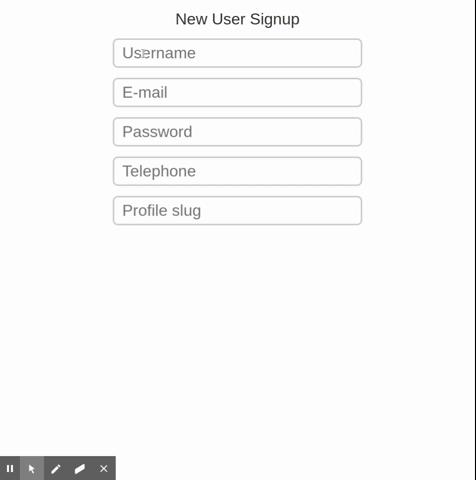

<h2 align="center">RegEx Poc :boom:</h2> 

  

Just some regex validations

## Some operators:
- `{1,5}` determines min and max values;
- `\d` any digit between 0-9;
- `\w` any alphanumeric digit a-z and 0-9 and underscore;
- `i` this operator permits expression case-sensitive;
- `^` determines start of expression;
- `$` determines end of expression;
- `[abc]` determines what characters was been matched, character set;
- `()` Groups multiple tokens together and creates a capture group for extracting a substring. 
- `.` will match any character, including new lines;
- `+` Matcher 1 or more of the preceding token;
- `|` Acts like a boolean OR, matches the expression before or after the |, 
- `\` escape character, used to character have special meaning, and should be preceded by a \ (backslash) to represent a literal character;

## For reference
- [RegExr](https://regexr.com/);

<h2 align="center">Layout of authentication</h2>

  

